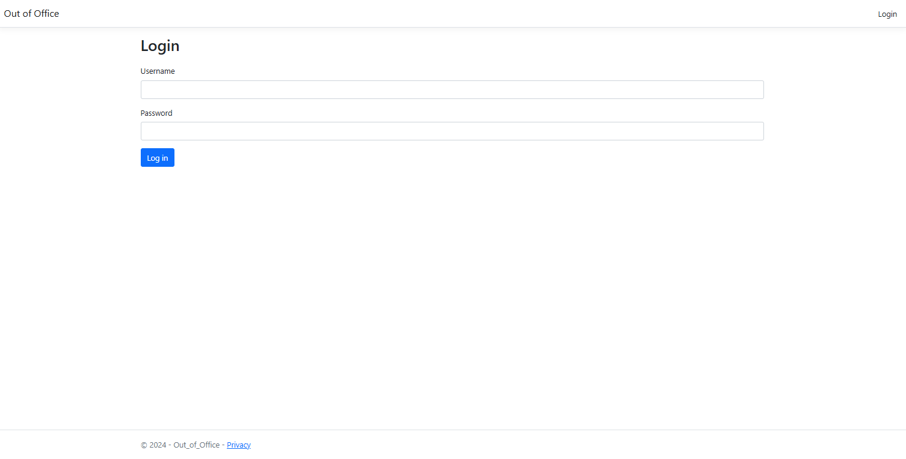
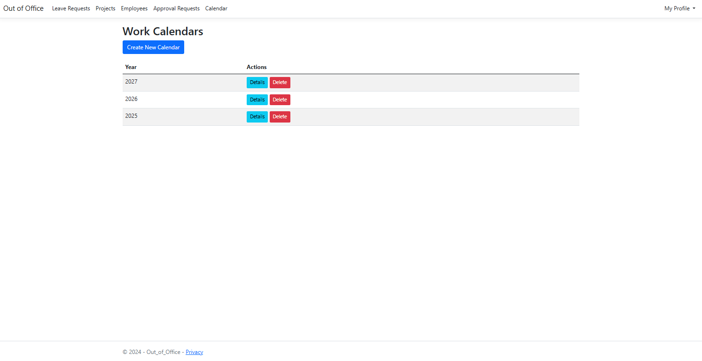

# 🏝️ Out of Office – Employee Leave Management System

Out of Office is a modern web application built with ASP.NET Core MVC, designed to streamline the management of employee leave requests, project assignments, approvals, and work calendars. The system follows Clean Architecture principles, CQRS (Command Query Responsibility Segregation), and SOLID design principles to ensure maintainability, scalability, and long-term evolution.

## Table of Contents

1. [Architecture & Technologies](#architecture--technologies)
2. [General Information](#general-information)
3. [Technologies Used](#technologies-used)
4. [Key Libraries & Design Patterns](#technologies-used)
5. [Core Features](#core-features)
6. [Screens](#screens)
7. [Getting started (Local Deployment with Docker)](#getting-started-local-deployment-with-docker)
8. [Contact](#contact)

## General Information

Out of Office is an employee leave and project management system designed for companies that need to handle employee absences, project assignments, and approval workflows in an organized and auditable way. It supports HR, managers, and employees by providing:

- A structured leave request and approval process.
- Integration with custom work calendars.
- Role-based access management for Administrators, HR, Project Managers, and Employees.
- Two-Factor Authentication **(2FA)** using Google Authenticator for enhanced security.
- Full change tracking via Audit Logs.

## Architecture & Technologies

The application is structured according to Clean Architecture, which separates concerns into four independent layers:

- **_Domain Layer:_** Defines core business models and rules.
- **_Application Layer:_** Implements application-specific logic using CQRS (Commands and Queries).
- **_Infrastructure Layer:_** Provides database access (Entity Framework Core with SQL Server), external integrations, and configuration services.
- **_Presentation Layer:_** ASP.NET Core MVC application using Razor Pages for user interface and interaction.

## Key Libraries & Design Patterns

- **CQRS (Command Query Responsibility Segregation)** – separates data read and write operations for better scalability and maintainability.
- **MediatR** – implements the Mediator pattern, simplifying the handling of commands and queries.
- **AutoMapper** – automates mapping between data transfer objects (DTOs) and domain entities.

## Technologies Used

- **_Language:_** C#, HTML, JavaScript
- **_Framework:_** ASP.NET Core MVC (.NET 8)
- **_Data Access:_** Entity Framework Core with SQL Server
- **_Frontend:_** Razor Pages (MVC), HTML, CSS, JavaScript, Bootstrap
- **_Pagination:_** X.PagedList for server-side pagination
- **_Authentication & Security:_** ASP.NET Core Identity with Two-Factor Authentication (2FA) using Google Authenticator
- **_Audit Logging:_** Change history tracking with Audit Log
- **_Development Tools:_** Visual Studio, Git

## Core Features

### 📅 Work Calendar

Configure and maintain a custom work calendar for validating leave requests.

### 📝 Leave Request

- View leave requests with filtering, sorting, and pagination.
- Add new leave requests with validation against the configured work calendar.

### 👥 Employee

- Filter, sort, activate, edit, and add employees.
- Pagination for handling large employee lists.

### 📁 Project Management

- Create, activate/deactivate projects.
- Assign employees to projects and manage project details.

### ✅ Approval Requests

Filter, sort, approve or reject leave requests.

### 🔐 User Roles & Authentication

- Secure login system.
- Role-based access for Administrator, HR, Project Manager, and Employee.
- User profile management including leave balances and password change.
- Two-Factor Authentication (2FA) with Google Authenticator.

### 🕵️‍♂️ Audit Logging

Complete history of changes made in the system for security and compliance.

## Screens

<p align="center"><strong>Login Page</strong></p>



<p align="center"><strong>User Profile</strong></p>


<p align="center"><strong>Two-Factor Authentication (2FA) Setup</strong></p>


<p align="center"><strong>List of employees</strong></p>


<p align="center"><strong>Employee details</strong></p>


<p align="center"><strong>List of leave requests</strong></p>


<p align="center"><strong>Leave request details</strong></p>


<p align="center"><strong>List of projects</strong></p>


<p align="center"><strong>Project details</strong></p>


<p align="center"><strong>List of approval requests</strong></p>


<p align="center"><strong>Approval request details</strong></p>


<p align="center"><strong>List of calendars</strong></p>



<p align="center"><strong>Calendar details</strong></p>


<p align="center"><strong>Create new calendar</strong></p>


## Getting started (Local Deployment with Docker)

### Prerequisites

Follow these steps to run the application locally using Docker Desktop:
Docker Desktop must be installed and running on your machine.

👉 [Download Docker Desktop](https://www.docker.com/products/docker-desktop)

### Setup Instructions

- Launch Docker Desktop
- Ensure Docker Desktop is running on your machine.

### Prepare a Local Folder

Create a folder on your system where you will clone the project.

### Clone the Repository

```
git clone https://github.com/Brajnn/Out-of-Office-team.git
```

### Create an Environment File

Inside the project root, create a file named .env and paste the following content:

```
DATABASE_HOST=
DATABASE_NAME=
DATABASE_USER=
SA_PASSWORD=
```

**Example (don't use this login, create your own)**

```
DATABASE_HOST=sqldata
DATABASE_NAME=OutOfOfficeDb
DATABASE_USER=sa
SA_PASSWORD=YourStrong@Passw0rd
```

#### ⚠️ Important: The SA_PASSWORD must meet SQL Server's strong password policy, which requires at least:

- 8 characters
- Uppercase and lowercase letters
- Numbers
- Special characters

### Navigate to the Project Directory

Example (Windows CMD):

```
cd C:\Users\YourUser\Desktop\YourFolder\Out-of-Office-team
```

### Build and Start the Docker Containers

Run the following command:

```
docker-compose up -d --build
```

_🛠️ Docker will build and initialize the containers. This may take several minutes on the first run._

### Access the Application

Once the containers are up, open your browser and navigate to:

```
http://localhost:8080
```

### Default Administrator Login

- Login: `admin125`
- Password: `Admin123!`

### _⚠️ Security Notice:_

- **Change your password immediately after the first login.**
- **Enable Two-Factor Authentication (2FA) using Google Authenticator for increased account security.**

After completing these steps, you are ready to manage employees, projects, leave requests, approvals, and system settings as an administrator.

## Contact

If you have any questions, suggestions, or would like to contribute to this project, feel free to contact the project maintainer:

**Author:** _Brajan Alterman_

**Email:** _brajanalterman@gmail.com_
